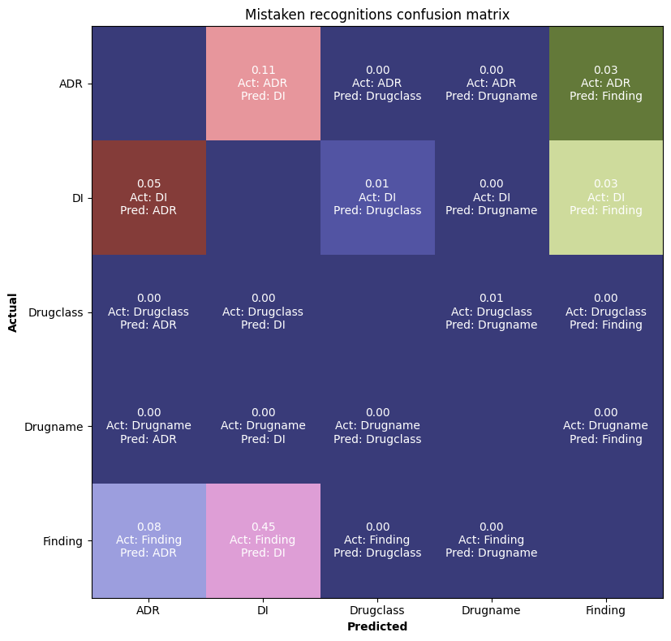

# Error analysis for `instruct-ner`
You can view three types of model errors:
1. **Mistaken recognition** - one type of entity is recognized as another
2. **Entity is not recognized**
3. **Overpredictiton**


```python
import pandas as pd
prediction = pd.read_json('prediction.json')
prediction.head(3)
```
|    | id            | extracted                                                                                                 | target                                                                                                    |
|---:|:--------------|:----------------------------------------------------------------------------------------------------------|:----------------------------------------------------------------------------------------------------------|
|  0 | 8_1443820.tsv | {'Drugname': [], 'Drugclass': [], 'Drugform': ['таблетки'], 'DI': [], 'ADR': [], 'Finding': []}           | {'Drugname': [], 'Drugclass': [], 'Drugform': ['таблетки'], 'DI': [], 'ADR': [], 'Finding': []}           |
|  1 | 1_2555494.tsv | {'Drugname': ['Римантадин'], 'Drugclass': [], 'Drugform': ['сиропе'], 'DI': [], 'ADR': [], 'Finding': []} | {'Drugname': ['Римантадин'], 'Drugclass': [], 'Drugform': ['сиропе'], 'DI': [], 'ADR': [], 'Finding': []} |
|  2 | 1_618967.tsv  | {'Drugname': [], 'Drugclass': [], 'Drugform': [], 'DI': [], 'ADR': [], 'Finding': []}                     | {'Drugname': [], 'Drugclass': [], 'Drugform': [], 'DI': [], 'ADR': [], 'Finding': []}   

```python
from error_analysis.utils import aggregate_errors_from_dataframe

aggregate_errors_from_dataframe(prediction)
```

```python
>>> {'total': 1443,
    'fp': 282,
    'fn': 373,
    'mistaken_recognitions': defaultdict(list,
                {'Finding': [('нервные срывы', 'ADR', '4_2671902.tsv'),
                ('профилактике', 'DI', '0_1484511.tsv'),
                ('гриппа', 'DI', '0_1484511.tsv'),
                ('дифтерия', 'DI', '8_2394715.tsv'),
                ('столбняк', 'DI', '8_2394715.tsv'),
                ('коклюш', 'DI', '8_2394715.tsv'),
                ('бородавка на подушечке указательного пальца',
                    'DI',
                    '6_1410682.tsv'), ...
```
## Mistaken recognitions
`mistaken_recognition` was created according to the scheme below: 
```python
mistaken_recognitions[real_target].append((text, predicted_target, sample_id))
```
Error below 
```python
{'Finding': [('нервные срывы', 'ADR', '4_2671902.tsv')]}
```
corresponds to
```python
predicted: {'Drugname': [],
 'Drugclass': [],
 'Drugform': [],
 'DI': [],
 'ADR': ['нервные срывы'],
 'Finding': []}

target: {'Drugname': [],
 'Drugclass': [],
 'Drugform': [],
 'DI': [],
 'ADR': [],
 'Finding': ['нервные срывы']}
```

### Mistaken recognitions confusion matrix
```python
from error_analysis.utils import plot_confusion_matrix_from_dataframe

plot_confusion_matrix_from_dataframe(prediction)
```


In percent (no. mistaken recognitions / no. of entities of this type): 
```python
plot_confusion_matrix_from_dataframe(prediction, in_percent=True)
```
